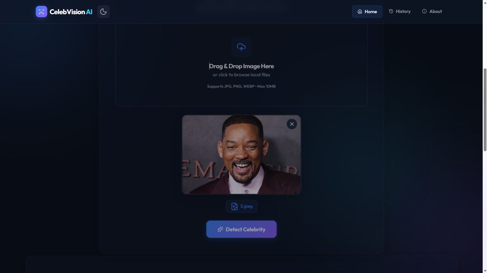

# ⭐ CelebVision AI: Serverless Celebrity Recognition Platform




CelebVision AI is an enterprise-grade, event-driven serverless computer vision platform built entirely on AWS infrastructure. The application provides a modern glassmorphic interface where users upload images and instantly receive AI-powered celebrity recognition results, confidence scores, and historical detection records powered by Amazon Rekognition, AWS Lambda, Amazon S3, API Gateway, and DynamoDB.

---

# 🏗️ Architecture Blueprint

The solution follows a scalable, loosely coupled serverless architecture designed for low latency, automatic scaling, and zero server management.

```
                  ┌─────────────────────┐
                  │     User Browser    │
                  └──────────┬──────────┘
                             │
                    Upload Image (POST)
                             │
                             ▼
                  ┌─────────────────────┐
                  │   Flask Frontend    │
                  └──────────┬──────────┘
                             │
                    Upload Image to S3
                             │
                             ▼
                  ┌─────────────────────┐
                  │     Amazon S3       │
                  └──────────┬──────────┘
                             │
                     Image Reference
                             │
                             ▼
                  ┌─────────────────────┐
                  │    API Gateway      │
                  └──────────┬──────────┘
                             │
                      Invoke Lambda
                             │
                             ▼
          ┌────────────────────────────────────┐
          │ AWS Lambda (Celebrity Detector)    │
          └──────────────┬───────────────┬─────┘
                         │               │
                         ▼               ▼
              Amazon Rekognition    Amazon DynamoDB
             Celebrity Detection      Detection Logs
```

### **Presentation Layer**

A responsive Flask web application featuring an intuitive drag-and-drop image uploader, glassmorphism-inspired interface, real-time API communication, and animated result cards for seamless user interaction.

### **Storage Layer**

Uploaded images are securely stored in Amazon S3, providing durable object storage while serving as the input source for AI inference.

### **Compute Layer**

AWS Lambda acts as the stateless processing engine. It retrieves uploaded images from Amazon S3, invokes Amazon Rekognition, formats recognition results, and stores metadata in DynamoDB.

### **Recognition Engine**

Amazon Rekognition applies pre-trained deep learning computer vision models to detect celebrities, estimate facial similarity, and generate confidence scores within milliseconds.

### **Persistence Layer**

Every successful recognition request is archived in Amazon DynamoDB, allowing historical searches, analytics, and audit logging without managing traditional databases.

---

# 🛠️ Infrastructure Component Breakdown

| AWS Service | Functional Role |
| :--- | :--- |
| **Amazon Rekognition** | Performs AI-powered celebrity recognition using deep learning facial analysis. |
| **AWS Lambda** | Executes serverless image processing logic and coordinates AWS service interactions. |
| **Amazon API Gateway** | Exposes REST APIs for celebrity detection requests. |
| **Amazon S3** | Securely stores uploaded images before AI analysis. |
| **Amazon DynamoDB** | Maintains recognition history, confidence scores, timestamps, and metadata. |
| **AWS IAM** | Implements least-privilege permissions across AWS services. |
| **Amazon CloudWatch** | Collects execution logs, monitoring metrics, and performance insights. |

---

# 💻 Technical Design Highlights

## Deep Learning Face Recognition Pipeline

Amazon Rekognition extracts facial embeddings from uploaded images and compares them against AWS's global celebrity knowledge base. The highest-confidence match is returned together with confidence values and associated metadata.

### Confidence Evaluation

To reduce false positive detections, the application validates matches against a configurable confidence threshold.

```text
Recognition Confidence ≥ 50%
          │
          ├────────► Celebrity Verified
          │
Recognition Confidence < 50%
          │
          └────────► Unknown Person
```

---

## Historical Detection Logging

Every successful recognition request automatically generates a structured record containing:

- Celebrity Name
- Recognition Confidence
- Image Filename
- Detection Timestamp
- AWS Request ID

These records are persisted inside Amazon DynamoDB, enabling future analytics and historical lookup without requiring relational databases.

---

# 🚀 Step-by-Step Deployment Guide

## 1. Create Python Virtual Environment

```bash
python -m venv myvenv

# Windows
.\myvenv\Scripts\activate

# Linux / macOS
source myvenv/bin/activate
```

Install dependencies

```bash
pip install -r requirements.txt
```

---

## 2. Configure AWS Credentials

```bash
aws configure
```

Provide:

```text
AWS Access Key ID
AWS Secret Access Key
Region: ap-south-1
Output Format: json
```

---

## 3. Create AWS Resources

Create the following AWS services:

- Amazon S3 Bucket
- Amazon DynamoDB Table
- AWS Lambda Function
- Amazon API Gateway
- IAM Role with Rekognition, DynamoDB, and S3 permissions

---

## 4. Deploy Lambda Function

Package the Lambda function.

```bash
zip lambda_function.zip lambda_function.py
```

Deploy using AWS CLI.

```bash
aws lambda update-function-code \
    --function-name CelebrityDetector \
    --zip-file fileb://lambda_function.zip
```

---

## 5. Run Flask Application

```bash
python app.py
```

Visit

```
http://127.0.0.1:5000
```

Upload an image and receive AI-powered celebrity recognition results instantly.

---

# 📈 Learning Outcomes

This project demonstrates practical experience with:

- Serverless cloud application architecture
- Amazon Rekognition AI integration
- RESTful API development using API Gateway
- AWS Lambda event-driven computing
- Secure object storage using Amazon S3
- High-performance NoSQL database design with DynamoDB
- IAM least-privilege security implementation
- Cloud monitoring with Amazon CloudWatch
- Flask frontend integration with AWS backend services

---

# 👨‍💻 Technologies Used

- Python 3.12
- Flask
- Amazon Rekognition
- AWS Lambda
- Amazon API Gateway
- Amazon DynamoDB
- Amazon S3
- Boto3
- HTML5
- CSS3
- JavaScript

---

# 👤 Author

**Ayush Chaudhari**

Cloud Computing • Python Developer • AWS Enthusiast

---

# 📄 License

This project is developed for educational purposes and demonstrates practical implementation of serverless AI applications using Amazon Web Services.
